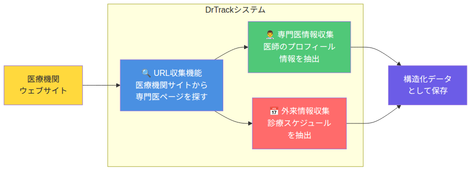
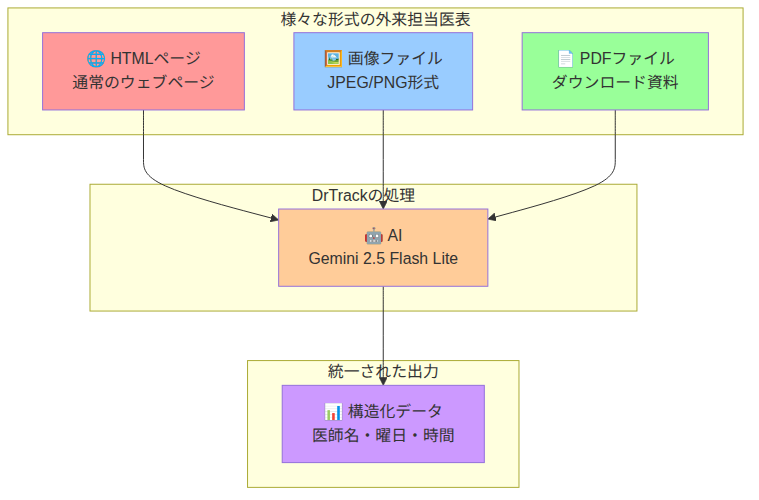

<!-- _class: lead -->

# DrTrack情報収集システム
## アーキテクチャ紹介

---

# 収集する情報の種類

医療機関のウェブサイトから2種類の情報を収集します

## 🏥 専門医情報
- 医師の氏名、専門分野、資格、経歴など

## 📅 外来担当医表  
- 各医師の診療スケジュール（曜日・時間帯）

<!-- Note: collection_example.pngは収集情報の例を示すMermaid図 -->

---

# システムの全体像

<!-- Note: system_overview.pngはDrTrackの3つの主要機能を示すブロック図 -->

**3つの主要機能が連携して動作します**

---

# 動作の流れ（URL収集）

医療施設のTOPページURLから専門医情報･外来担当医表ページを自動で探します

<!-- Note: url_collection_flow.pngはURL収集の段階的処理を示すフローチャート -->

---

# 動作の流れ（情報抽出）

収集したページから必要な情報(専門医情報･外来担当医表)を抽出し、データベースへ保存します

<!-- Note: data_extraction_flow.pngはデータ処理フローを示す図 -->

---

# マルチモーダル対応

様々な形式の情報源に対応しています

<!-- Note: multimodal_support.pngは各形式からの情報抽出を示す図 -->

**どんな形式でも統一されたデータとして出力**

---

# AIの活用方法

最新のAI技術「Gemini 2.5 Flash Lite」が情報を読み取ります

<!-- Note: ai_extraction.pngはAIがページを理解する様子を示す図 -->

**人間が読むように内容を理解し、必要な情報を抽出**

---

# クラウドインフラの活用

Google Cloud Platformで安定・高速・セキュアに動作

<!-- Note: cloud_infrastructure.pngはGCPの構成を示す概念図 -->

**処理量に応じて自動的にリソースを調整**
